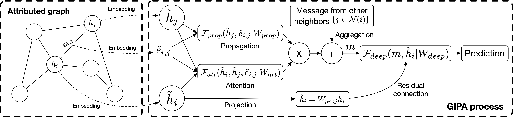

# GIPA: General Information Propagation Algorithm

This repository is the [DGL](https://github.com/dmlc/dgl)-implemention of GIPA (General Information Propagation Algorithm). The following figure illustrates the process of GIPA:



## Datasets

The protein dataset ```ogbn-proteins``` from [Open Graph Benchmark](https://ogb.stanford.edu/).

## Usage

To train the model:

```python
source main.sh
```

Or:

```python
python src/main.py --n-layers 6 --n-epochs 8000 --lr 0.01 --batch-size 8000 --use-label --if-save --preprocess --n-hop 1 --gpu 0 --eval-every 5 --seed 0
```

To use the pre-trained model to do inference: see the Jupyter notebook in ```/example/gipa_test.ipynb```. 

## Requirements

```python
ogb==1.3.0
numpy==1.19.2
torch==1.7.1
dgl_cu110==0.5.3
```

